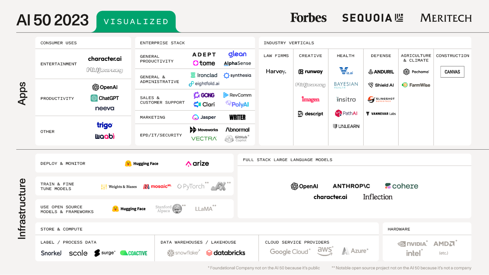

Illustration: Shyamal × DALL·E

The past year has been both wild and very empowering. Wild because of an apparent fast take off in AI, and empowering because of lots of love for language user interfaces and support from the community to embrace human-AI co-creation. ChatGPT has given many people the same tingling feeling they experienced when playing for the first time with a PC back in the day. Heard from my friends, “they felt like kids visiting a park for the first time; trying new things, and jumping to the next ride as soon as done with one”. AI has done more good so far and we better understand the stakes and seriousness of misalignment. 2022/3 has been a key milestone in building the future for humanity, with humanity. ChatGPT has become a necessity, and AI, plus all the adjacent vectors supporting it, have become a critical component in developing society and systems. Foundational models are getting multi-modal, more capable, aligned, and safer – gpt4 being the most complex software humanity has likely produced. Technology is pushing the boundaries to simplify the underlying complexities of the world as we understand the perplexity of the internet and how humans reason and think. As traditional software was eating the world, AI, particularly generative AI, is eating software, driving a new wave of innovation reshaping the way we interact with technology, and redefining the nature of creativity and intelligence. AI is not only a disruptive, frontier technology; it’s a utility everyone wants and one we must harness, channel, and build guardrails around. It’s important to call out that AI is incredibly exciting, and its potential seems boundless. But we can't lose sight of the risks of AI alignment. We all have a part to play in ensuring this technology reflects our shared values and ethics. It's a thrilling journey, but safety must be a non-negotiable priority.

Let’s explore some developments that have been made across some key verticals and the factors that determine the success of startups in this space. Note that it’s hard to predict far ahead as these are still early days, so please approach any extrapolations in this write-up with caution.

## **New Interaction Paradigms and Capabilities**

One of the most significant developments in AI is the emergence of new interaction paradigms & capabilities which have given rise to “co-pilot for x” like projects such as AI x lawyers, AI x tutors, AI x under-writers, AI x coaches, and so on. Numerous teams across the globe are pursuing these moonshot ideas, and it is only a matter of time before some of these names become household staples. The most useful generative AI applications have been in areas where validating a produced artifact's accuracy, quality, and completeness requires significantly less time and effort than initially creating it. Take, for example, the case of an accountant who can verify a personal tax return in a fraction of the time it would require to create one from scratch. Over time, that distribution may shift in the other direction (it will get harder for us to verify AI-generated artifacts, including new scientific research).

### **AI-native vs AI-enabled**

As our hierarchy of needs progressed, so have the abstractions of technology that aim to simplify. AI-enabled experiences are bringing AI to people’s existing workflows and tools. Meanwhile, AI-native startups are thinking from AI-first principles and redefining interaction with every software with natural language, focusing on the job to be done without having the user worry about the underlying complexity of working with specific tools and UIs. Language is the highest level of abstraction and likely the most efficient way we can communicate with humans and machines – at least, until we figure out neural interfaces. 

We’d love to wake up to a friendly assistant who can experience the world as we do, help us achieve our goals, plan our day, automate knowledge work, supercharge businesses, help humans figure out cancer and space exploration, amplify our strengths, and generally make us happier. ChatGPT and the plugins paradigm, one of the few disruptive technologies that have helped lift humanity at scale, exemplifies this trend. These technologies continue to push the boundaries of what we can achieve, acting as a force multiplier for various creative and reasoning tasks. Plus, enhancing our abilities to learn, communicate, and create will have a transformative impact on how we live and work. The application layer is shaping up to automate highly repetitive tasks and/or supercharge humans-in-the-loop, and B2B startups are working on bringing AI to business workflows with differentiated UX and natural language interfaces and new ways to work with unstructured data at scale. As the space matures, we are witnessing the adoption of AI-enabled products like [NotionAI](https://www.notion.so/product/ai), which involve integrating foundational models into existing workflows and products, and AI-native platforms like [Descript](https://www.descript.com/), which is reimagining video-editing & content creation with AI-first principles. AI-based personal assistants are simplifying the interaction layer for consumers, enabling them to accomplish objective-driven tasks with natural language. The value of AI lies not only in its ability to generate better quality content but also in its capacity to distill and reduce the overload of diluted information. By extracting meaningful signals from the noise, AI consequently becomes indispensable.

## **Foundations, Infrastructure, and Tooling**

At the infra and tooling layer, we’re seeing a stack emerge - new primitives and LLMOps platforms that lower the barrier to entry and accelerate the creation of LLM applications at scale. [Langchain](https://python.langchain.com/en/latest/), which has become an important part of the stack, is making it easier to build data-aware and agentic LLM applications and making them easier to deploy. [Portkey](https://portkey.ai/) is building an LMOps stack for monitoring, model management, and more, while [Vellum](https://www.vellum.ai/) is developing a dev platform for LLM applications. Companies like [AirOps](https://www.airops.com/) are creating platforms that allow businesses to apply AI in a structured, predictable way to their workflows, customizable to their specific business context. Vector databases are becoming a critical part of the stack, as embeddings drive the fuel to build LLM applications with retrieval and search functionalities. [Weaviate](https://weaviate.io/) is one such company building an open-source AI-native vector DB. We will likely see an array of platforms geared towards helping trace and evaluate LLM workflows, reducing hallucinations, making the models more steerable, streamlining data security, and providing tooling that informs the ethical readiness and integrity for AI-enabled applications. LLMOps is still in its infancy, roughly broken down into these categories: (1) prompt management & evals (prompt engineering, audit, tracking, a/b testing, prompt chaining, debugging prompts, evaluation, etc.). This also includes prompt chaining across multiple foundation model providers (2) no-code/low code fine-tuning/embeddings management (including tools for retraining generalist models on targeted data sets. labeling, cleaning, etc.) (3) agent integration/action based - LLMs making decisions about actions, executing those actions, goal-planning, interfacing w/ external world, etc (4) analytics/observability - cost, latency, rate limit management, explainability and so on. Open-source projects in this space should look at product-market fit at least twice - first, to create value and community around the project and second, while wrapping a business around it. Creating a reliable and adaptable layer of infrastructure and tools for LLMs will help us unlock their power and value for more users and applications.

Just as semiconductor chips have journeyed to commoditization, foundational models (OpenAI, Anthropic, etc.) are now on a similar path. Today's cutting-edge LLMs quickly become tomorrow's standard due to the relentless pace of innovation, shifting the value focus from mere possession to unique applications, customizations, and integrations. Thus, competitiveness stems not from technological access but from innovation and application. Both open-source and proprietary LLMs have a role to play in this evolving paradigm, with businesses faced with choices based on their unique balance of trade-offs, including security, safety, licensing, fine-tuning, performance, cost, latency, and capabilities. Open-source foundation models will probably be at least a couple of generations behind primarily due to compute, capital, data, and alignment progress - but they will be a critical part of several business workflows for which they’re effective. Efforts to train smaller models on more data have shown promise, outperforming larger models in some benchmarks. Moreover, the goal to make such models more accessible has seen some success, with models like Meta's LLaMa and Stanford's Alpaca being available for researchers and even hobbyists to train and run their models. Overall, for builders leveraging generative AI models, the focus should be on domain specialization and building products users love, not the underlying technology. 

Bridging the gap between foundational models and their real-world applications, edge computing emerges as a potent platform for deploying these models, driving AI innovation to new frontiers. Earlier this year, Qualcomm AI Research successfully deployed a popular 1B+ parameter foundation model (stable diffusion) on an edge device through full-stack AI optimization. Edge AI is becoming essential due to its capability for real-time data processing, improved privacy, and enhanced security. It is becoming increasingly significant across various verticals due to the proliferation of devices with numerous sensors producing vast amounts of data. The complexity and resource demands of foundational models pose deployment challenges on edge devices. To counter this, the focus will shift toward specialized hardware, optimization techniques, and neural processor architectures. Being able to run optimized versions of foundational models at the edge/on-device will open up endless possibilities. Recognizing these emerging requirements, [BrainChip](https://brainchip.com/) has stepped forward with innovative solutions like the Akida processor, an advanced neural processing system for edge AI. It’s important to understand and assess edge AI technology to overcome deployment challenges and explore new potentials.

## **Applications, Impact, and Verticals**

The convergence of technology is real, and we are on the cusp of reducing the marginal cost of creativity and intelligence—a lot is going on. At the enterprise stack level, we’re seeing accelerating growth and entrants leveraging generative AI in marketing, sales, productivity, security, customer support, etc. As language models become better at reasoning, more factual, and steerable, we’re inherently seeing adoption across several verticals, including legal, healthcare, education, construction, climate, and creative fields. Let’s start with the ones with the highest impact. In education, for instance, Khan Academy uses [GPT-4 to power Khanmigo](https://www.ted.com/talks/sal_khan_how_ai_could_save_not_destroy_education/c), an AI-powered assistant that functions as a virtual tutor for students and a classroom assistant for teachers. The potential of AI to provide personalized, low-cost tutoring to every student on Earth gives me goosebumps. The worries around plagiarism in classes with the help of LLMs are being better addressed (through curriculum re-design, awareness, and tools like [gptzero](https://gptzero.me/)); for instance, [NYC public schools recently reversed the ChatGPT ban](https://www.forbes.com/sites/anafaguy/2023/05/18/new-york-city-public-schools-reverses-chatgpt-ban/) after realizing and embracing its potential for teachers & students; it’s a great brainstorming and creativity companion. Additionally, as privacy and data usage [concerns are being better addressed/clarified](https://www.theverge.com/2023/4/28/23702883/chatgpt-italy-ban-lifted-gpdp-data-protection-age-verification), this is gaining trust among users and countries. 

Healthcare, with human-in-the-loop, is poised to be re-defined. [Ambience’s AutoScribe](https://www.ambiencehealthcare.com/), for example, comprehensively captures the nuances of each patient story, with no virtual or in-person human scribe. Another startup operating in this space is [Glass Health](https://glass.health/) which is building a platform for AI-assisted, human-in-the-loop clinical decision-making for clinicians. Their platform combines an LLM with a clinical knowledge database, created and maintained by clinicians, to create DDx and Clinical Plan outputs. Both platforms enable doctors to spend more time with patients and automate monotonous/admin-related work. We also see opportunities at the foundational layer - with [Hippocratic AI](https://www.hippocraticai.com/) building a safety-focused LLM for healthcare - outperforming GPT-4 on 105 of 114 healthcare exams and certifications. Mental health is becoming democratized and more accessible. With declining mental health globally, providing efficient, personalized mental health at a marginal cost has never been a bigger challenge. [Kai.ai](https://kai.ai/) is building an AI wellness companion that helps you feel happier and calmer, as well as become the best version of yourself. Caregiving is another area where AI-driven solutions like ChatGPT have the potential to democratize and revolutionize the landscape. By connecting users to support groups, financial aid, and respite care services, ChatGPT can transform caregiving. [Milo](http://gomilo.com/) (a [Converge](https://openai.fund/news/introducing-converge) company), for example, is building a co-pilot for parents, giving busy parents back time and mindshare by tackling daily details with a behind-the-scenes co-pilot: “By pairing a human in the loop with the latest in LLM capabilities we're able to effectively build a co-pilot for detailed, high context and noisy tasks, via a simple conversational SMS interface.” It’s encouraging to see the level of accessibility reaching even the most isolated towns and villages in India: a testament to this is [KissanAI](https://kissan.ai/) which built an assistant for Indian farmers that helps them with a multilingual chatbot powered by ASR and LLM APIs and agriculture expert knowledge, enabling them to make more informed decisions and optimize their operations. This project allows the national agricultural hotline to scale and is being supported by the Indian government. 

Customer service and support engineering will gradually shift to less human-in-the-loop, allowing businesses to listen to customers more and drive customer-centricity. To give some examples, [Kapa](https://www.kapa.ai/) is building ChatGPT for developer-facing products, learning from developer docs, tutorials, chat logs, and GitHub issues to generate a chatbot that answers developer questions automatically. In the action-based customer service automation realm, [Ada](https://www.ada.cx/) is revolutionizing the customer experience with LLMs. “Ada is already using GPT-3 to automate the training of customer intents and the integration will be pushed further by automatically building answer flows and content from its customers' knowledge bases. Ada is also experimenting with generative AI to augment conversational insights provided to both bot builders and live agents.” Ada's resolution engine connects to business systems and takes action to improve resolution. As we move towards “level 5” customer service automation, our the success metrics & focus should revolve more around resolution and less around deflection. Plus, I believe a system like this will reflect a better understanding of complex intents, coherent responses, taking actions on behalf of users, fine-tuning customer data, automating workflows and content generation, and efficiently engaging humans in the loop.

Scientific progress is getting blessed. In drug discovery, we are already at the cusp of generative AI, helping accelerate the development of new drugs and reduce the likelihood of adverse side effects. [E-Therapeutics](https://www.etherapeutics.co.uk/about-us/), for example, is leveraging LLMs to further automate the quest to find new drug targets, notably in gene silencing. Moreover, how research is done will change - [Ought](https://ought.org/) is building [Elicit](https://elicit.org/), an AI research assistant that helps automate research workflows. Rightly so, we’re re-imaging fact-checking, experimentation, and building tools to accelerate scientific research. At the same time, we are building better tools to evaluate scientific claims made by performant foundational models. Robust evaluation frameworks and use-cases-specific evaluations are a step towards this. 

Foundational models are making recruitment and HR operations easier. [Dover](https://www.dover.com/) is working on deep AI personalization and customization for recruiting within their platform. They have built a version of a recruiting co-pilot that streamlines the hiring process. Code interviewing platforms like [CoderPad](https://coderpad.io/chatgpt/) have also integrated AI chat features designed to be collaborative, allowing the candidate and the interviewer to view and interact with an AI tab. In defense, [Scale AI](https://scale.com/donovan) has partnered with the XVIII Airborne Corps for the first LLM deployment to a US Government Classified Network. Scale Donovan, the company's federal AI platform, helps operators, analysts, and decision-makers understand, plan, and act in minutes instead of weeks. The platform also utilizes Reinforcement Learning From Human Feedback (RLHF) to continuously fine-tune the technology and better support mission objectives. In the legal domain, startups like [Harvey](https://www.harvey.ai/) are building co-pilots for lawyers, supercharging their workflows, and investing in systems that replicate best practices for establishing trust in knowledge work. As AI continues to reshape the legal profession, we may need to reconsider incentive structures that revolve around hourly pay, as the focus shifts toward the creative process and the value produced. System integrators are also benefiting from AI advancements. Service providers like [Distyl](https://distyl.ai/) are emerging to help deliver tailored AI solutions to enterprises. Just as [Ness](https://www.ness.com/industries/financial-services/) provides trading, risk, and cloud-enabling solutions to the global capital market, service providers will cater to bringing generative AI solutions to the financial sectors that have tasted success with these alliances.

We’re also re-inventing how software engineering is done and re-defining & supercharging SDLC. Five years back, it would have been unbelievable to think about code generation that just works. Today, we have AI pair programmers like Copilot, bringing back the joy of programming, allowing developers to stay on task resulting in [60-75% improvement](https://github.blog/2022-09-07-research-quantifying-github-copilots-impact-on-developer-productivity-and-happiness/) in developer satisfaction. We have seen IDE plugins like [Mintlify](https://mintlify.com/) that automate code documentation and [Codium](https://www.codium.ai/), a co-pilot for unit testing, and [Buildt](https://www.buildt.ai/) which helps developers search and understand large code bases. [Replit](https://replit.com/) allows users to build, test, and deploy directly from the browser, while their multiplayer and ghostwriter features enhance collaboration on code. Meanwhile, [Cursor](https://www.cursor.so/) is building an AI-native IDE experience for coders. Developer productivity is through the roof as [Copilot](https://github.com/features/copilot) drives adoption. 

Similar assistant & copilot-like interaction paradigms are being built across content generation, gaming, shopping, travel, finance, consumer packaged goods, healthcare, customer service, language learning verticals, and so on. To mention a few that come to mind (in no way necessarily the best in their class):

* [Jasper](https://www.jasper.ai/) is now exploring a B2B and platform play, building an intelligence layer for writing assistants that businesses can use. 
* In travel, [Navan](https://www.forbes.com/sites/johanmoreno/2023/05/05/navan-is-leveraging-generative-ai-to-help-companies-cut-costs/?sh=5042a5946b72) has integrated OpenAI and ChatGPT across their product set, using Ava, their virtual assistant, to personalize recommendations and increase traveler engagement. 
* In language learning, [Quazel](https://www.quazel.com/) is using LLMs, and betting on practicing speaking regularly, as the easiest way to learn a new language. Similarly, [Speak](https://www.speak.com/) has developed a collection of content experiences that allow learners to practice conversing in English, modeling everyday scenarios and interactions. 
* Within the consumer products space, [Turing Labs](https://www.turingsaas.com/), for example, allows CPG companies to instantly explore and assess formulation ideas using AI, decreasing the time from concept to production by months from a traditional process. 
* In gaming, [Latitude](https://latitude.io/) is building AI-generated games and is using generative AI to create content on-the-fly and allowing developers to create more engaging and interactive gaming experiences. [Unakin](https://www.unakin.ai/) is building an AI co-pilot for gaming studios. The non-deterministic nature of generative models can be a source of inspiration for both gaming developers and gamers. Moreover, AI x gaming can enrich NPCs, development of levels, help manage the complexity and consistency of in-gaming experiences, enhance graphics, and create powerful stories and narratives. 
* Finally, content creation is undergoing a healthy refresh as consumers prefer user-generated content to make purchasing decisions. The good news is that the cost of creating personalized, high-quality content is decreasing with more capable generative models. Humans prefer compelling narratives, and startups like [Tome](https://tome.app/) are enabling everyone to tell a compelling story.

The current year's AI 50 roster (visualized by [Sequoia](https://www.sequoiacap.com/article/ai-50-2023/)) below is just a glimpse into these verticals and the future of work.

This year AI’s 50 list, visualized by Sequoia

## **AI-IMPACT Framework for Builders**

As the doubts about creating a moat with LLM providers fade, we recognize that the platform does not guarantee equality. It's like gaming consoles being around for decades, yet game developers are still competing in creating the most immersive games. This highlights the importance of focusing on the unique value that startups can bring, rather than relying solely on the underlying platform. Disruption and innovator’s dilemmas are recurring & undeniable, and startups play a crucial role in navigating the complexities of this new frontier. Builders in this space are asking what some of the important things to remember as they land upon this inflection point are. Here’s a framework that’s hopefully easier to remember: The AI-IMPACT framework, which I believe will help guide builders in the pursuit of AI-enabled & AI- native products that people love, ship fast with a tight feedback loop, and build a data flywheel along the way. Here’s how it goes: 

1/ Authenticity: Establish a unique voice and value proposition. Focus on your expertise and the problem you're solving, not just the underlying platform. Your authenticity should come from the problem, your data, and the uniqueness of the solution, not the underlying foundational model provider.

2/ Interaction: Design intuitive, seamless Language User Interfaces that conform to user affordances. [As technology evolves, user interfaces might reduce (e.g., self-driving cars)](https://fullstackdeeplearning.com/llm-bootcamp/spring-2023/ux-for-luis/). Design for delight and trust.

3/ Moonshots: Pursue ambitious, transformative ideas with the potential to reshape industries and redefine technology interactions. Aim for high-impact products and experiences that improve lives.

4/ Personalization: Use AI to deliver personalized experiences based on users' needs, preferences, and goals. Customize your product with data-driven insights for greater relevance and engagement.

5/ Alignment: Ensure your applications and systems align with human values and ethics. Prioritize safety, responsible AI development, and transparency about technology and risks. Set user expectations upfront, and manage risks with human-in-the-loop amplification.

6/ Commitment towards shipping: ship often and incrementally, keeping a tight feedback loop. Remain agile and adaptive amid rapid technological advancements and changing user behaviors. Build for love.

7/ Technology Convergence: Leverage the convergence of technologies like AI, VR, quantum, and edge computing, etc., for building artifacts that push boundaries of what’s capable & build human-centric solutions that resonate with users, driving meaningful change across industries.

## **Opportunities for startups**

By understanding customer problems, shifting user behaviors, and maintaining a sharp focus on long-term vision, startups can harness the power of this new electricity to reshape the world and benefit humanity. The future TAMs are huge, with many ways to win if you lean into the fight with an authentic voice. High-performing startups with lean, efficient teams with a sharp focus and commitment to a clear vision have higher odds of winning. The best founders and teams I’ve worked with are deeply passionate about the problem, possess high EQ, don’t unknowingly act based on their associations + possess system 2 thinking, are agile, and are comfortable making big, long-term bets - thinking in decades, not days. We should be encouraged to work on ideas where the potential upside is way bigger than the perceived true downside; prefer winning over gambling to avoid losses. 

The internet brought more value to startups than incumbents (Amazon vs bookstores), mobile shift created new biz for incumbents, so it wasn’t big of a shift, but I believe with the pace of change with AI, there’s a prime opportunity for startups to disrupt incumbents for the first time in decades - largely due to capabilities, new interaction paradigms, and shifting user behaviors. Every AI person I know is beyond excited and is in “building mode”. Buckle up for startups++. We are talking about non-trivial GDP growth, enough to fuel universal basic income and lift humanity, protecting our fundamental rights, improving our lifespans, and making us happier and more fulfilled.

---

Please note that this blog post completely reflects my thoughts. Thanks to Pratik Desai, Michael King, Boris Power, and Emil Sorenson for reviewing early drafts.
